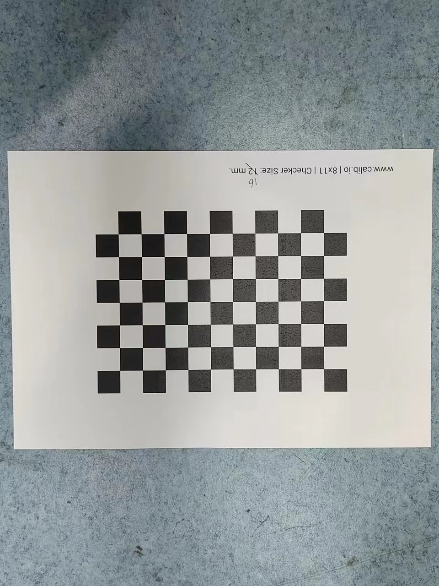

#### 这段代码用于相机的标定

需要使用到的库为`openCV`

`openCV`安装（Linux系统下）

```bash
sudo apt update
sudo apt install libopencv-dev python3-opencv
```

需要使用标准棋盘格。



标准棋盘格可以通过网上购买，如果对精度要求不是非常高，可以直接官方网站下载

网址：[棋盘格]([Calibration Checkerboard Collection | Mark Hedley Jones](https://markhedleyjones.com/projects/calibration-checkerboard-collection))

而后使用需要标定的相机进行各个方位的拍摄，为了使标定结果更加的准确，最好尽量水平拍摄。

将拍摄的图片放于文件夹中，该文件夹与标定源码放于同一目录中。

编译运行：

```bash
mkdir build && cd build
cmake ..
make 
./camera_parameter2
```

最终的标定结果放在`.txt`文件中。

#### This is the code for camera calibration.

The `opencv` library is used to calibrate the camera.

The internal parameter matrix and distortion coefficient of the camera are calculated.

`calibrateCamera` function in `opencv` can calibrate the camera.

Finally, a txt file is generated.

It stores the internal parameter matrix of the camera and the distortion coefficient of the camera